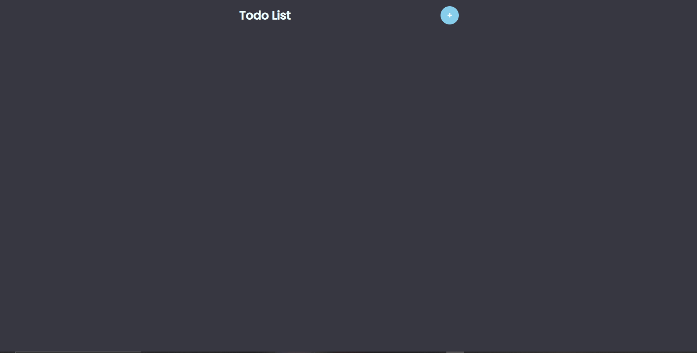

    <h1>Todo List</h1>

 

Este e um pequeno Todo List feito em React, para exercício que simula uma lista de tarefas, podendo adicionar e excluir itens na lista e marcações de status do item.  

 

# Features 
- [x] Adiciona e remove itens na lista
- [x] Marca status do item como por exemplo se esta "feito" ou "pendente" 

# DEMO 

<h1 align="center">
    
</h1>